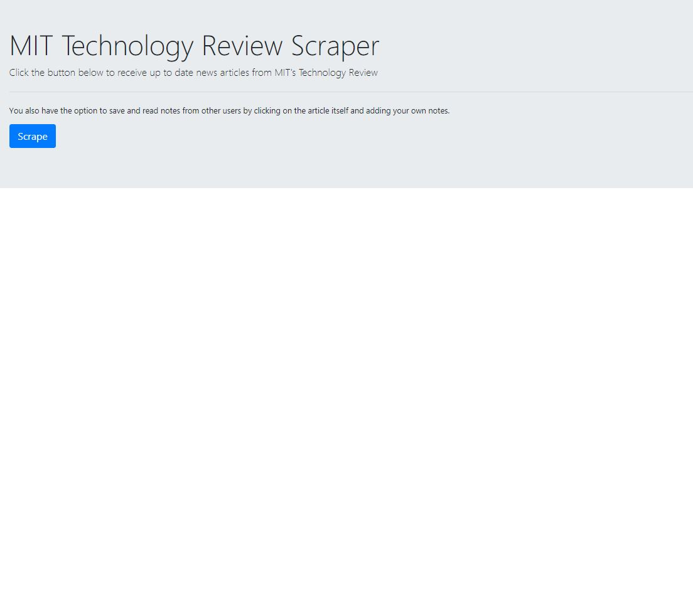
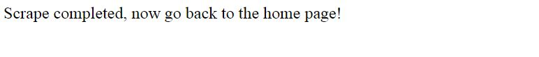
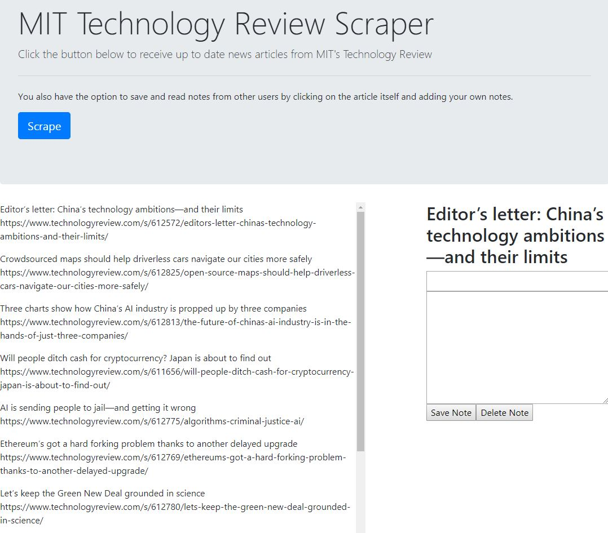
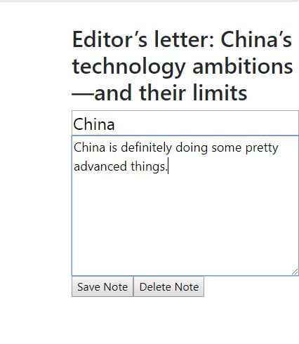

# News Scraper
News Scraper is an application that will show you in real time the most current articles that are being posted in MIT Technology Review.

## Live Deployment

https://jtalafriendfinder.herokuapp.com/
## Getting Started

Click on the scrape button to generate articles.

Heading back to the home page will generate all the current MIT Technology Articles.

You may now write notes into the text box, save the notes for others to read, and even delete the note.

